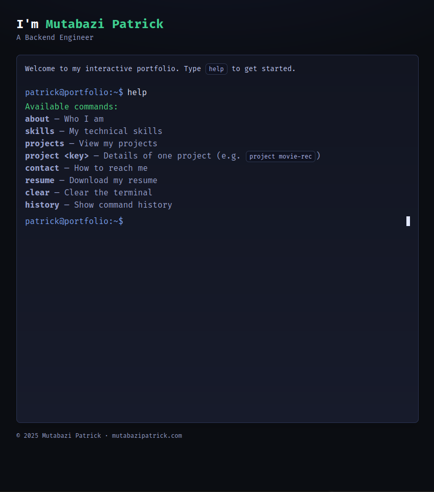

# Terminal Portfolio

An **interactive terminal-style portfolio website** for showcasing my backend developer skills.  
Built as a single-file HTML app — no build tools required.



## ✨ Features

- Runs directly in the browser (just open `index.html`)
- Terminal-like interface with blinking cursor and command history
- Custom commands:
  - `help` — list available commands
  - `about` — who I am
  - `skills` — technical skills and stacks
  - `projects` — list projects
  - `project <key>` — detailed project info
  - `contact` — how to reach me
  - `resume` — link to my resume
  - `history` — view typed commands
  - `clear` — clear the terminal
- Styled with TailwindCSS (via CDN) + Fira Code font
- Mobile responsive design

## 🚀 Getting Started

### Run locally
Clone this repo and open `index.html` in your browser:

```bash
git clone https://github.com/MutabPato/terminal-portfolio.git
cd terminal-portfolio
xdg-open index.html   # Linux
open index.html       # macOS
# or double-click index.html on Windows
```

You can also serve it locally with Python:

```bash
python3 -m http.server 8080
# open http://localhost:8080/terminal_portfolio_index.html
```

### Deploy
Easily deploy to [GitHub Pages](https://pages.github.com/), [Vercel](https://vercel.com/), or [Netlify](https://www.netlify.com/).

## 📂 Project Structure

```
.
├── index.html              # Main portfolio file (terminal UI + JS logic)
├── screenshot.png          # Preview screenshot (add your own)
└── README.md               # Project documentation
```

## 🛠️ Technologies

- HTML5 / JavaScript (Vanilla)
- [TailwindCSS](https://tailwindcss.com/) (via CDN)
- [Fira Code](https://fonts.google.com/specimen/Fira+Code) font

## 👨‍💻 Author

**Mutabazi Patrick**  
Backend Engineer · Django/DRF · Node.js · PostgreSQL · Redis · Docker

- Website: [mutabazipatrick.com](https://mutabazipatrick.com)
- GitHub: [@MutabPato](https://github.com/MutabPato)
- LinkedIn: [mutabazipatrick](https://www.linkedin.com/in/mutabazipatrick/)
- X: [@mutab_pato](https://x.com/mutab_pato)

---
© 2025 Mutabazi Patrick — Built with ❤️ and JavaScript.
